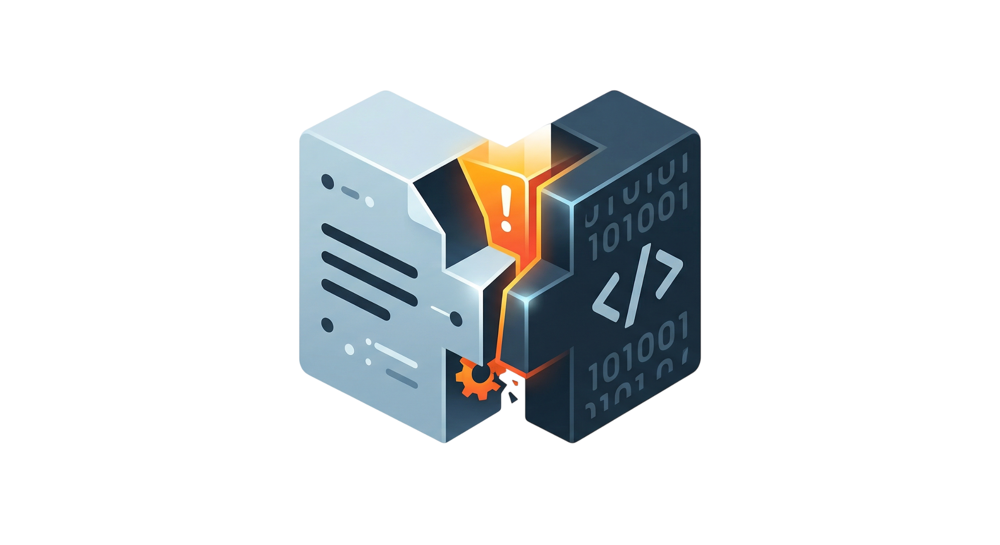

<p align="center">
  
</p>

<h1 align="center">LyingDocs</h1>

<p align="center">
  Your docs are lying. Here's how to find out.
</p>

---

Every codebase has them: features documented but never shipped, behavior that quietly diverged from the spec, values claimed to be configurable that are hardcoded deep in a function nobody reads. In the age of Vibe Coding, developers ship both code and docs through LLMs — fast, fluid, and increasingly misaligned.

LyingDocs deploys two autonomous agents against your repository to surface these inconsistencies before your users do.

---

## How it works

**Hermes** autonomously traverses your documentation, plans an audit strategy, and dispatches targeted analysis tasks.

**Codex** executes each task against your actual codebase, reporting what the code *really* does.

Hermes reconciles the two — and writes you a report.

---

## Installation

```bash
pip install lyingdocs
```

## Quick Start

```bash
export OPENAI_API_KEY="sk-..."

lyingdocs analyze --doc-path docs/ --code-path . -o output/audit
```

## Configuration

LyingDocs loads configuration from multiple sources (later overrides earlier):

1. **Built-in defaults** (OpenAI API, gpt-4o)
2. **Config file** — `lyingdocs.toml` in project root, or `~/.config/lyingdocs/config.toml`
3. **Environment variables** / `.env` file
4. **CLI arguments**

### Config File Example

```toml
base_url = "https://api.openai.com/v1"
model = "gpt-5.4"

[codex]
enabled = true
provider = "openai"
wire_api = "responses"
# path = "/usr/local/bin/codex"  # optional: explicit path to codex binary

[limits]
max_dispatches = 20
max_iterations = 50
codex_task_timeout = 1200
token_budget = 524288
```

### Environment Variables

| Variable | Description |
|----------|-------------|
| `OPENAI_API_KEY` | **Required.** Your OpenAI API key |
| `BASE_URL` | API base URL |
| `MODEL` | LLM model name |
| `CODEX_PROVIDER` | Codex CLI model provider |
| `CODEX_WIRE_API` | Codex CLI provider wire_api setting ('responses' or 'chat') |
| `CODEX_PATH` | Explicit path to codex binary |
| `CODEX_TASK_TIMEOUT` | Timeout per codex task (seconds) |
| `TOKEN_BUDGET` | Max context tokens before compression |

---

## Codex CLI Setup

LyingDocs optionally uses [OpenAI Codex CLI](https://github.com/openai/codex) for deep code analysis. Without it, the agent will still work but rely on documentation analysis only.

```bash
npm install -g @openai/codex

# Or disable entirely
lyingdocs analyze --doc-path docs/ --code-path . --no-codex
```

LyingDocs auto-detects Codex in this order:
1. Explicit path from config (`codex.path`)
2. System PATH (`which codex`)
3. Local `node_modules/.bin/codex`

---

## CLI Reference

```bash
# Full analysis
lyingdocs analyze --doc-path docs/ --code-path . -o output/audit

# With custom model
lyingdocs analyze --doc-path docs/ --code-path . -m gpt-4o-mini

# Resume interrupted analysis
lyingdocs analyze --doc-path docs/ --code-path . --resume

# Without Codex
lyingdocs analyze --doc-path docs/ --code-path . --no-codex

# With explicit config file
lyingdocs analyze --doc-path docs/ --code-path . --config myconfig.toml

# Show version
lyingdocs version
```

---

## Misalignment Categories

| Category | Description |
|----------|-------------|
| **LogicMismatch** | Code contradicts documentation |
| **PhantomSpec** | Documentation describes non-existent features |
| **ShadowLogic** | Important undocumented code logic |
| **HardcodedDrift** | Supposedly configurable values that are hardcoded |

---

## Roadmap

- [ ] **Multi-harness support** — plug in Claude Code or any code agent alongside Codex
- [ ] **Deeper analysis** — multi-hop reasoning across doc hierarchies; version-aware diffing to catch when code changed but docs didn't
- [ ] **Auto-fix mode** — Hermes proposes doc patches; you review and apply

---

## For Researchers 🔬

A paper is just another kind of documentation — a translation of code into human language, written under deadline, reviewed long after the implementation settled.

If you've ever wondered whether your repo can be used by other researchers, or whether there are misalignments between your paper and your code, LyingDocs can help you find out.

The problem is the same. Paper is documentation for code. LyingDocs is for papers too.

---

## License

MIT